[TOC]

 基于DeepFace的防欺骗人脸认证系统使用说明文档

# 关于程序

语言：python 3.9

相关库：

aiohttp          3.8.1

cmake           3.26.0

cvzone          1.5.6

dlib           19.24.0

imutils          0.5.4

matplotlib        3.7.0

mediapipe         0.9.1.0

numpy           1.23.5

opencv-contrib-python   4.7.0.72

opencv-python       4.5.5.62

opencv-python-headless  4.6.0.66

pandas          1.5.3

Pillow          9.3.0

pygame          2.3.0

PyMySQL          1.0.2

PySide2          5.15.2.1

rembg           2.0.30

requests         2.28.2

scipy           1.9.3

# 整体UI界面

##   主页：

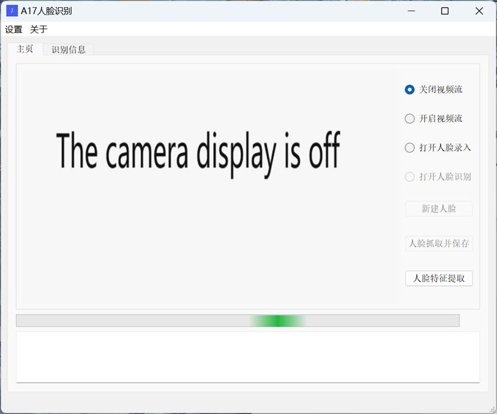

##   信息查询：

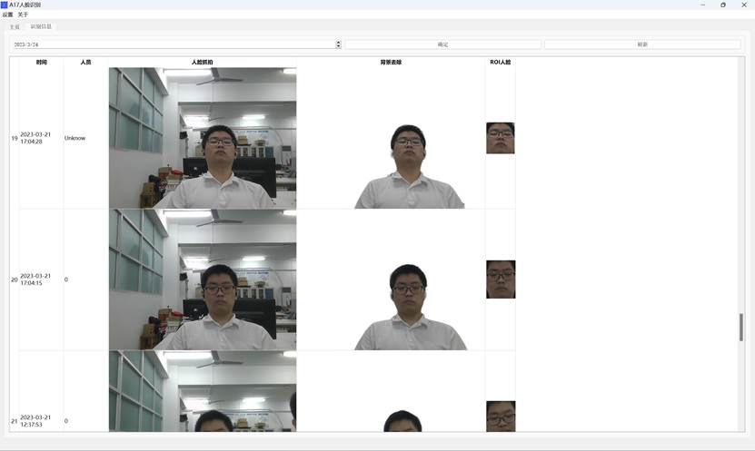

##   设置：

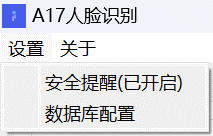

##   数据库配置：

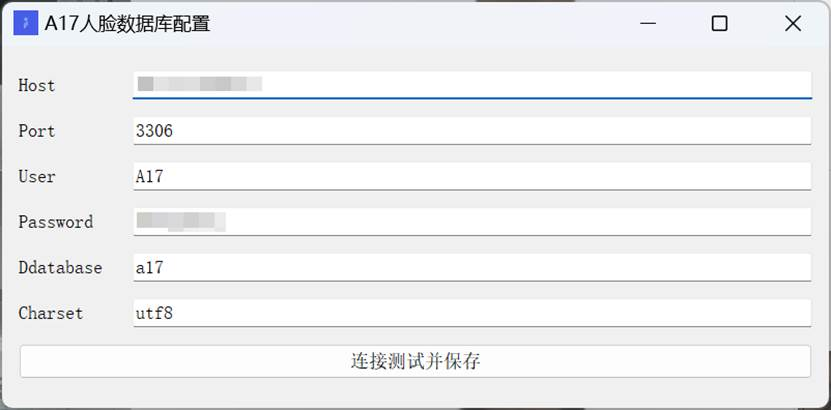

##   关于->团队信息:

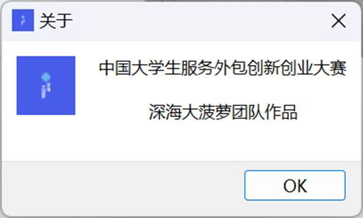

 

# 流程图

## 高清PDF:https://www.aliyundrive.com/s/ajdgx4boheX

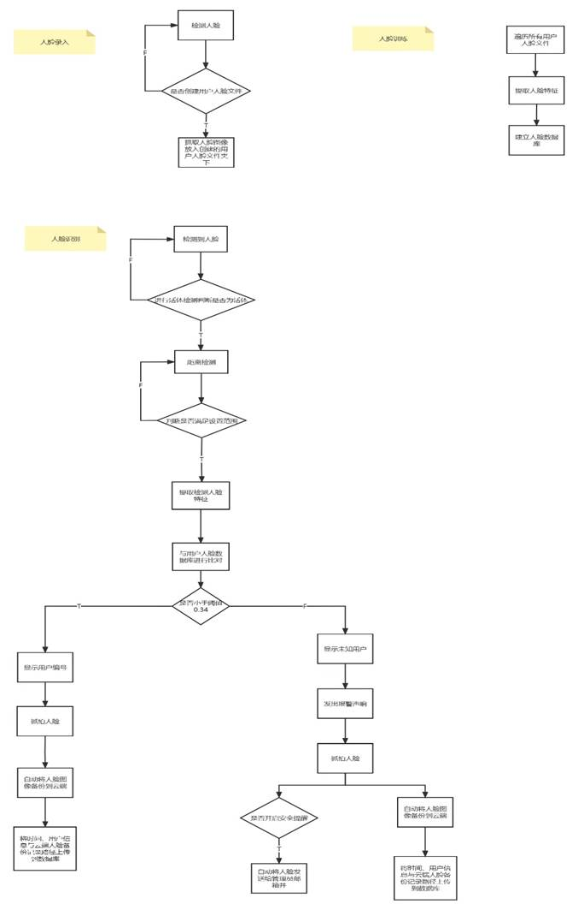

# 关于文件

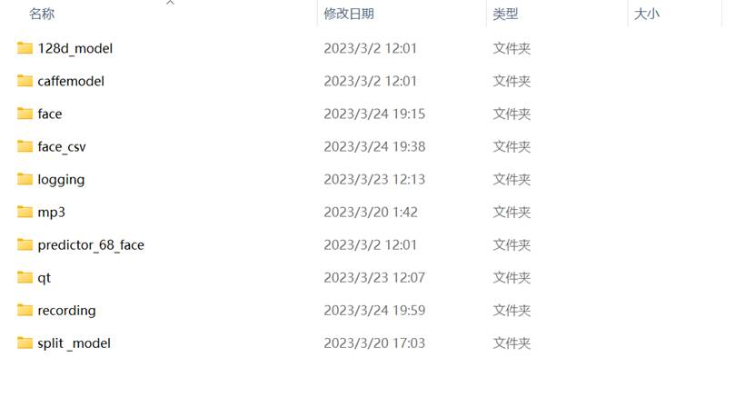

## 128d_model文件夹

内容：存放基于Residual Neural Network(残差网络)的CNN模型

作用：人脸图片转128D矢量

## Caffemodel文件夹

​    内容：存放caffe网络模型

​    作用：用于人脸检测

## Face文件夹

内容：存放用户录入人脸

作用：为人脸训练提供图片

## Face_csv文件夹

​    内容：存放csv格式的用户人脸数据文件

​    作用：为人脸识别提供用户数据

## Logging文件夹

​    内容：存放程序运行日志

​    作用：提供程序日志

## Mp3文件夹

​    内容：存放报警音频文件

​    作用：提供报警音频

## Predictor_68_face文件夹

内容：存放人脸68关键点模型

作用：计算人脸离摄像头距离和人脸关键点定位、检测

## Qt文件夹

​    内容：存放GUI视图的UI文件

​    作用：提供GUI页面

## Recording文件夹

​    内容：存放历史识别抓取图像

​    作用：为查找进出提供图片

## split _model文件夹

​    内容：存放基于U2-Net模型训练得到的人体分割模型

​    作用：提供人体图像分割

# 关于程序日志文件

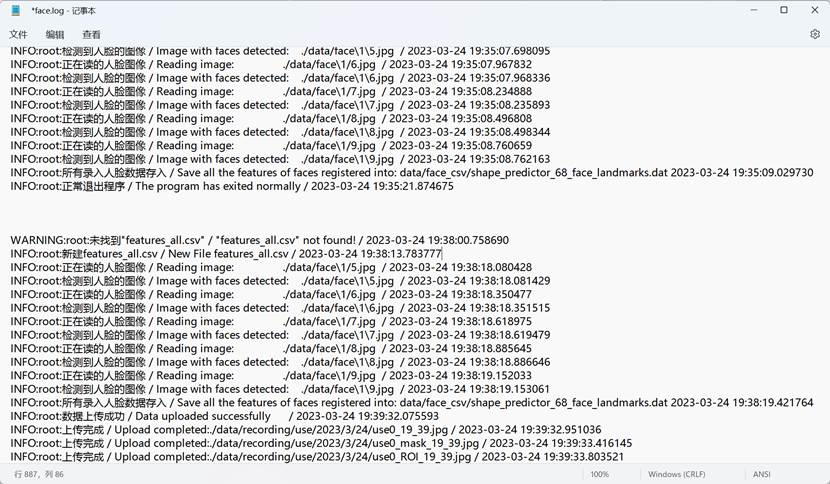

# 人脸识别算法说明

- 基于 Residual Neural Network     / 残差网络的 CNN 模型;
- This model is a ResNet network with 29 conv layers.

# 人脸识别算法精度

- When using a distance threshold of 0.6, the dlib model obtains     an accuracy of 99.38% on the standard LFW face recognition benchmark.

# 使用手册

## 安全提醒

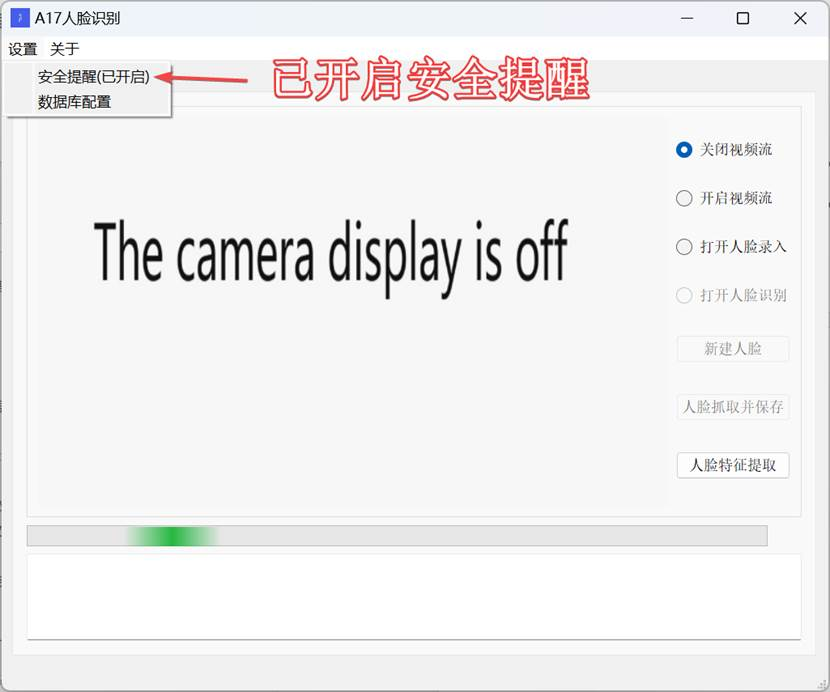

再次点击将关闭安全提醒功能，如下图所示

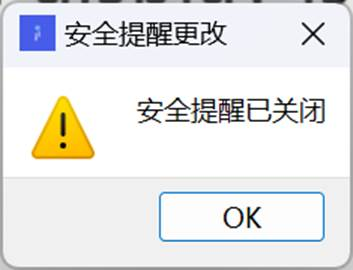

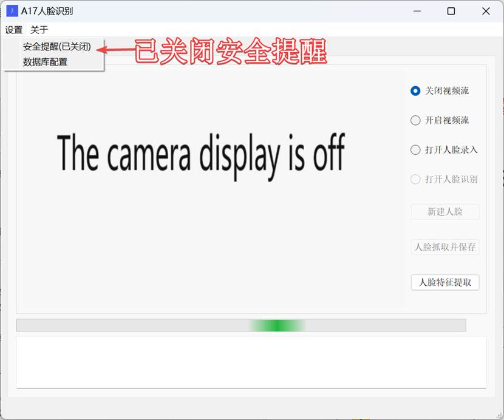

**开启通知**

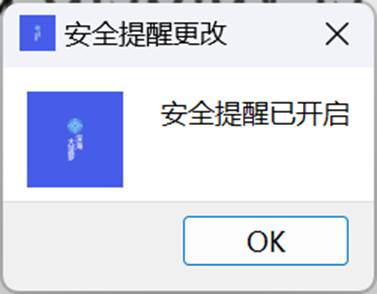-

## 数据库配置

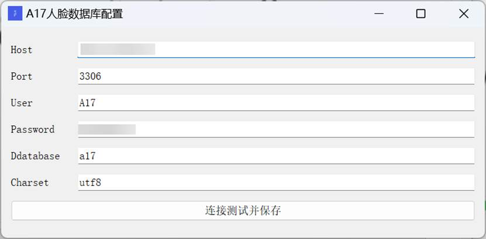

填写对应数据可以进行数据库的连接，能将信息上传到数据库中

连接成功如下图所示

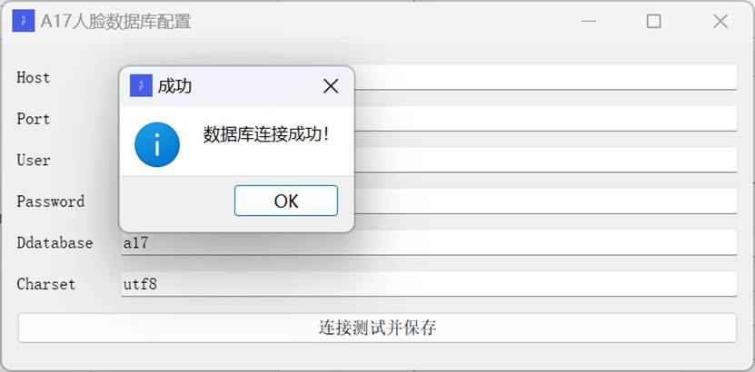

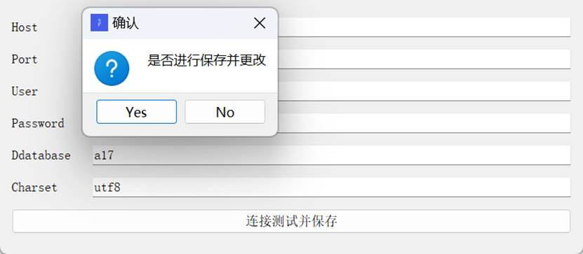

连接失败如下图所示

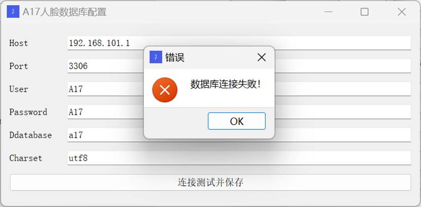

## 关闭摄像头

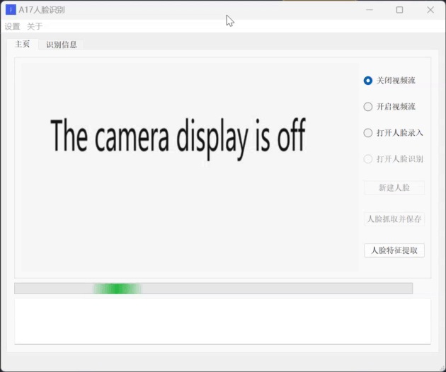

## 打开摄像头

## 人脸录入

左上角的FPS是指帧率，在未打开人脸录入按钮前“新建人脸”和“人脸抓取并保存”按钮不可用，打开人脸录入后“新建人脸”可用，点击“新建人脸“创建用户人脸文件夹后才可进行”人脸抓取并保存“。

## 人脸训练

提取未进行训练的用户人脸，并建立对应用户的人脸数据，放入人脸数据库中。下方的进度条是训练进度为用户提供进度查看。

## 人脸识别

左上角左上角的FPS是指帧率，Deep是指人脸离摄像头的距离，如图3-7-1所示。当超出预定范围则提示超出范围如图3-7-2所示。

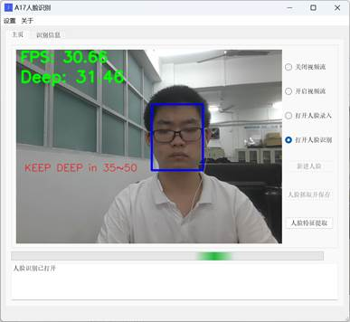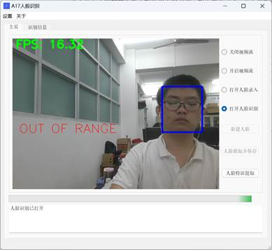

​            3-7-1                                3-7-2

 

若不存在人脸数据库将不能使用人脸识别，如下图3-7-3，存在则如图3-7-4。

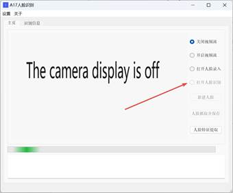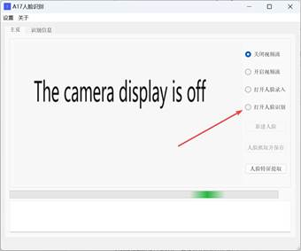

​           3-7-3                          3-7-4

 

先进行画面识别判断是否存在人脸，为安全性考虑检测时不能出现一张以上人脸，再进行活体检测判断是否为活人，最后再距离检测，若是活人并达到指定则进行识别。

### 未知用户

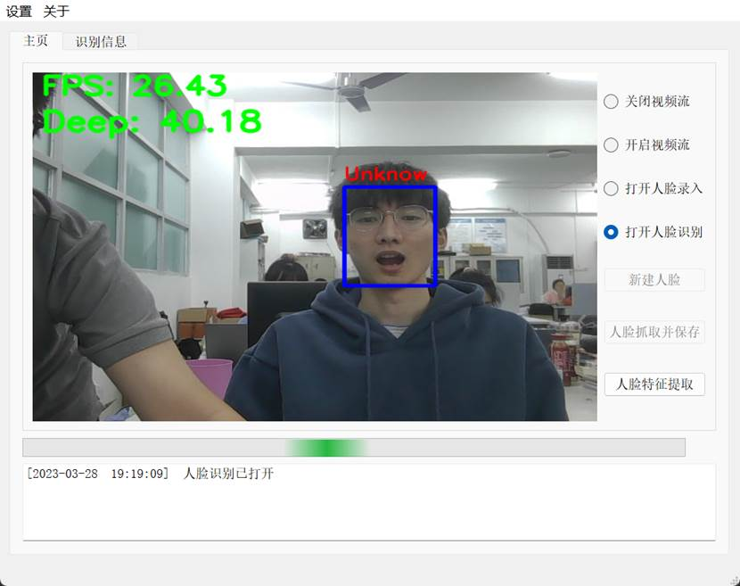

 

#### 报警声音

该报警会持续下去直到用户识别成功才能停止报警声响。

#### 安全提醒

### 录入用户

## 查询识别记录

### 所有记录

### 指定日期记录

 

 

 

## 本地数据与云端同步

